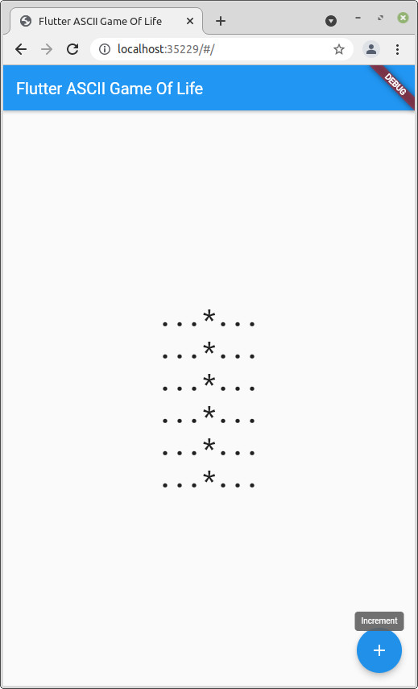

# Flutter ASCII Game Of Life

Example of Flutter as a Container for pure Dart ascii game (Game Of Life).

Ascii game class source: `https://github.com/nemilya/game_life_dart/`

Flutter project was created by command (web platform):

    flutter create --platforms web flutter_ascii_game_of_life

Added monospace font (from `https://fonts.google.com/specimen/Roboto+Mono`)

Small fixes to include class (todo: link to commit).

Start:

    $ cd flutter_ascii_game_of_life
    $ flutter run

Build web:

    $ flutter build web

Deploy: copy `build/web/*` to web-server.

## Screenshot

## Demo

[Demo Flutter ASCII Game Of Life (web)](https://nemilya.github.io/flutter_ascii_game_of_life/)

